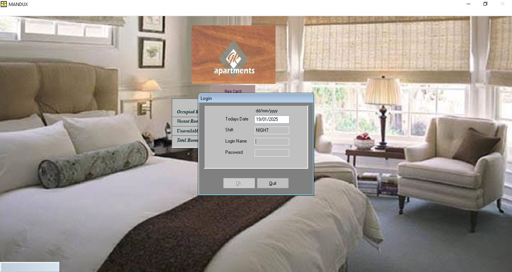

# Freelance Portfolio Management System

 <!-- Replace with actual logo if available -->

## Overview

**Freelance Portfolio Management System** is a powerful, full-stack desktop application designed to showcase professional portfolios with seamless content management capabilities. As a skilled full-stack developer, I've engineered this sophisticated solution using PHP, MySQL, and modern web technologies, integrated with phpdesktop for native desktop deployment. This system empowers freelancers to professionally present their work, education, projects, and contact information while providing robust admin controls for dynamic content updates.

Currently **under active production and continuous development**, this application demonstrates enterprise-level architecture, secure authentication, responsive design, and scalable functionality. It's a testament to my expertise in building production-ready applications that blend backend robustness with intuitive frontend experiences, making it ideal for freelancers seeking to impress clients and potential employers.

This system is not just a portfolio—it's a comprehensive tool that transforms how professionals manage and present their digital presence, with features that rival commercial CMS platforms while maintaining lightweight, offline-capable performance.

## 🚀 Key Highlights

- **Full-Stack Excellence**: Masterful integration of PHP backend, MySQL database, and JavaScript-enhanced frontend
- **Desktop-Native Deployment**: Powered by phpdesktop for seamless, browser-independent execution
- **Admin-Powered Content Management**: Intuitive dashboard for updating portfolio sections without coding
- **Secure & Scalable**: Role-based access, encrypted sessions, and optimized database queries
- **Responsive & Modern UI**: AdminLTE-based interface with Bootstrap for cross-device compatibility
- **Production-Ready Features**: File uploads, dynamic navigation, and real-time content rendering
- **Developer Showcase**: Highlights advanced skills in OOP PHP, database design, and system integration

## ✨ Features

### Core Functionality
- **Dynamic Portfolio Sections**: Manage About, Education, Work Experience, Projects, and Contact pages with rich content editing
- **Secure Admin Dashboard**: Centralized control panel for all content updates, user management, and system settings
- **File Upload & Image Management**: Secure handling of profile images, project screenshots, and documents
- **Real-Time Navigation**: Dynamic sidebar menu that adapts to active sections with active state highlighting
- **User Authentication**: Secure login system with session management and password protection

### Admin Management Tools
- **Content CRUD Operations**: Create, Read, Update, Delete functionality for all portfolio sections
- **System Settings**: Configure site-wide parameters like logo, short name, and user avatars
- **User Profile Integration**: Admin users can update personal details directly from the dashboard
- **Modal-Based Editing**: Efficient inline editing with confirmation modals for data integrity
- **Error Handling**: Graceful 404 pages and validation for all inputs

### Advanced Capabilities
- **Responsive Design**: Mobile-friendly interface using AdminLTE and Bootstrap 4
- **Interactive Elements**: JavaScript-powered modals, dynamic loading, and sidebar collapse/expand
- **Database-Driven**: MySQL backend with optimized queries for fast performance
- **Security Layers**: SQL injection prevention, XSS protection, and secure file uploads
- **Extensibility**: Modular structure for easy addition of new sections or features

### Fascinating Aspects
This system's power lies in its elegance: a single-file deployment via phpdesktop turns complex web functionality into a standalone executable. Imagine updating your entire professional portfolio offline, with changes instantly reflected across sections— no servers, no hosting costs. The OOP architecture in PHP classes (e.g., DBConnection, SystemSettings, Users) ensures maintainability, while the AdminLTE theme provides a professional, enterprise-grade look that impresses visitors.

## 🛠 Tech Stack

### Backend
- **PHP 8+**: Object-Oriented Programming with secure database interactions
- **MySQL**: Relational database for content storage and user management
- **PDO/Mysqli**: Secure database abstraction for query execution

### Frontend
- **AdminLTE 3.x**: Premium dashboard template with Bootstrap 4 integration
- **HTML5/CSS3**: Semantic markup and responsive styling
- **JavaScript/jQuery**: Dynamic interactions, modals, and AJAX functionality
- **Font Awesome**: Icon library for enhanced UI/UX

### Desktop Integration
- **phpdesktop**: Chromium-based framework for native Windows desktop app
- **Apache (via XAMPP)**: Local server simulation for development

### Development Tools
- **XAMPP**: Complete development environment (Apache, MySQL, PHP)
- **Git**: Version control for collaborative development
- **VS Code**: IDE with PHP extensions for efficient coding

### Security & Utilities
- **Session Management**: Secure PHP sessions with regeneration
- **File Validation**: Image upload security with type/size checks
- **Plugins**: Integrated libraries for enhanced functionality (e.g., DataTables, SweetAlert)

## 📦 Installation & Setup

### Prerequisites
- **Windows 10/11**: Primary platform for phpdesktop deployment
- **XAMPP 8.0+**: For local development and testing (Apache, MySQL, PHP)
- **phpdesktop**: Download from [phpdesktop.com](https://github.com/cztomczak/phpdesktop) for desktop executable creation
- **Git**: For cloning the repository

### Development Setup (XAMPP)

1. **Clone the Repository**
   ```bash
   git clone https://github.com/impecca/freelance-portfolio-system.git
   cd freelance-portfolio-system
   ```

2. **XAMPP Configuration**
   - Install XAMPP from [apachefriends.org](https://www.apachefriends.org/)
   - Start Apache and MySQL services in XAMPP Control Panel
   - Copy project folder to `C:/xampp/htdocs/freelance`

3. **Database Setup**
   - Open phpMyAdmin: `http://localhost/phpmyadmin`
   - Create database: `db_freelance`
   - Import SQL: Select database → Import → Choose `database/db_freelance.sql` → Go

4. **Access the Application**
   - Frontend: `http://localhost/freelance/`
   - Admin: `http://localhost/freelance/admin/`
   - Default Login: Username `impecca` | Password `impecca123`

### Desktop Deployment (phpdesktop)

1. **Download phpdesktop**
   - Get the latest release from GitHub
   - Extract to a folder (e.g., `FreelancePortfolioApp`)

2. **Integrate Project**
   - Copy all project files into `phpdesktop/www/`
   - Update `settings.json` in phpdesktop root:
     ```json
     {
       "web_server": {
         "listen_on": ["127.0.0.1", 8080],
         "web_root": "www"
       }
     }
     ```

3. **Run as Desktop App**
   - Execute `phpdesktop-chrome.exe`
   - Application launches in embedded browser
   - Distribute as single executable for clients

### Troubleshooting
- **MySQL Connection Error**: Ensure MySQL is running in XAMPP (port 3306)
- **File Permissions**: Set `uploads/` to writable (chmod 755 on Linux/Mac)
- **phpdesktop Issues**: Verify PHP version compatibility (8.0+)

## 🎯 Usage Guide

### Login & Authentication
1. Navigate to Admin Panel: `http://localhost/freelance/admin/`
2. Enter Credentials:
   - **Username**: `impecca`
   - **Password**: `impecca123`
3. Dashboard loads with personalized user panel showing avatar and name

### Dashboard Navigation
- **Sidebar Menu**: Dynamic navigation with icons for each section
  - **Dashboard**: Overview with quick stats and recent activities
  - **About**: Manage personal bio and introduction
  - **Education**: Add/update academic qualifications and certifications
  - **Work**: Track professional experience and job history
  - **Projects**: Showcase portfolio items with images and descriptions
  - **Contact**: Handle contact form settings and inquiries
- **Active Section Highlighting**: JavaScript auto-highlights current page in sidebar
- **User Panel**: Click to edit profile (avatar, name) directly from sidebar

### Operating Key Functions
1. **Content Management**:
   - Click any menu item (e.g., "Work")
   - Use inline forms/modals to add/edit entries
   - Upload images via secure file handler (e.g., project screenshots)
   - Save changes—content updates instantly across frontend

2. **System Settings**:
   - Access via Classes/SystemSettings.php (developer mode)
   - Update logo, short name, and global configs
   - Changes reflect in brand logo and site title

3. **Frontend Viewing**:
   - Visit `http://localhost/freelance/` to see live portfolio
   - Sections pull dynamic data from database
   - Responsive design adapts to desktop/mobile

4. **Advanced Operations**:
   - **Modal Editing**: Use "uni_modal" for quick updates without page reload
   - **Confirmation Dialogs**: "confirm_modal" prevents accidental deletes
   - **Image Viewer**: "viewer_modal" for previewing uploads
   - **Dynamic Loading**: Pages load via PHP includes based on `?page=` parameter

### Example Workflow: Adding a Project
1. Login to admin dashboard
2. Navigate to "Project" in sidebar
3. Click "Add New" (modal opens)
4. Enter title, description, upload image
5. Set status (active/inactive)
6. Save—project appears in frontend portfolio instantly

## 📊 System Architecture

```
├── admin/                      # Admin dashboard (AdminLTE)
│   ├── inc/                    # Includes (header, footer, navigation)
│   ├── about/                  # About section management
│   ├── education/              # Education CRUD
│   ├── work/                   # Work experience management
│   ├── project/                # Projects portfolio
│   └── contact/                # Contact handling
├── classes/                    # PHP OOP Classes
│   ├── DBConnection.php        # Database handler
│   ├── SystemSettings.php      # Global settings
│   ├── Users.php               # User management
│   └── Content.php             # Content operations
├── inc/                        # Shared includes (frontend)
├── plugins/                    # AdminLTE plugins (Bootstrap, jQuery, etc.)
├── uploads/                    # Secure file storage
├── config.php                  # Configuration loader
├── initialize.php              # Constants and DB setup
└── database/db_freelance.sql   # MySQL schema
```

### Database Schema
- **users**: Authentication and profiles
- **system_settings**: Site configurations (logo, name)
- **content tables**: Section-specific data (education, work, projects)
- Relationships: Foreign keys ensure data integrity

## 🔒 Security Features

- **Authentication**: Hashed passwords, session validation via `sess_auth.php`
- **Input Sanitization**: Escaped outputs to prevent XSS
- **SQL Security**: Prepared statements in DBConnection
- **File Security**: Validated uploads in `uploads/` with .htaccess restrictions
- **Access Control**: Admin-only routes protected by session checks

## 🚀 Performance & Scalability

- **Optimized Queries**: Efficient MySQL joins for content retrieval
- **Caching**: Session-based data storage for repeated access
- **Lightweight**: Minimal dependencies for fast loading
- **Modular Design**: Easy to extend with new sections (e.g., add "Skills" module)

## 🔄 Under Active Production

This system is **in active development** with planned enhancements:
- Advanced analytics dashboard
- Client inquiry management
- Multi-language support
- API endpoints for integrations
- Enhanced mobile app via phpdesktop

Feedback-driven iterations ensure it evolves with real-world needs.

## 🤝 Contributing

As a demonstration of professional practices:
1. Fork the repository
2. Create feature branches (`git checkout -b feature/amazing-new-section`)
3. Commit changes (`git commit -m 'Add: New portfolio section'`)
4. Push to branch (`git push origin feature/amazing-new-section`)
5. Open Pull Request with detailed description

Follow PSR-12 coding standards for PHP contributions.

## 📞 Support & Contact

For inquiries, collaborations, or customizations:
- **Developer**: impecca (Full-Stack Developer)
- **Email**: impeccableolisa@gmail.com
- **LinkedIn**: https://www.linkedin.com/in/olisah-impeccable-4633582a3?utm_source=share&utm_campaign=share_via&utm_content=profile&utm_medium=android_app

Ready to build custom solutions or enhance this system for your needs!

## 📄 License
Free for personal/portfolio use. Commercial licensing available for enterprise deployments.

---

**Crafted with expertise by a dedicated full-stack developer. This isn't just a portfolio—it's a powerful tool that showcases innovation and professionalism in every line of code.**

*Elevate your freelance career with a system as dynamic and capable as you are.*
